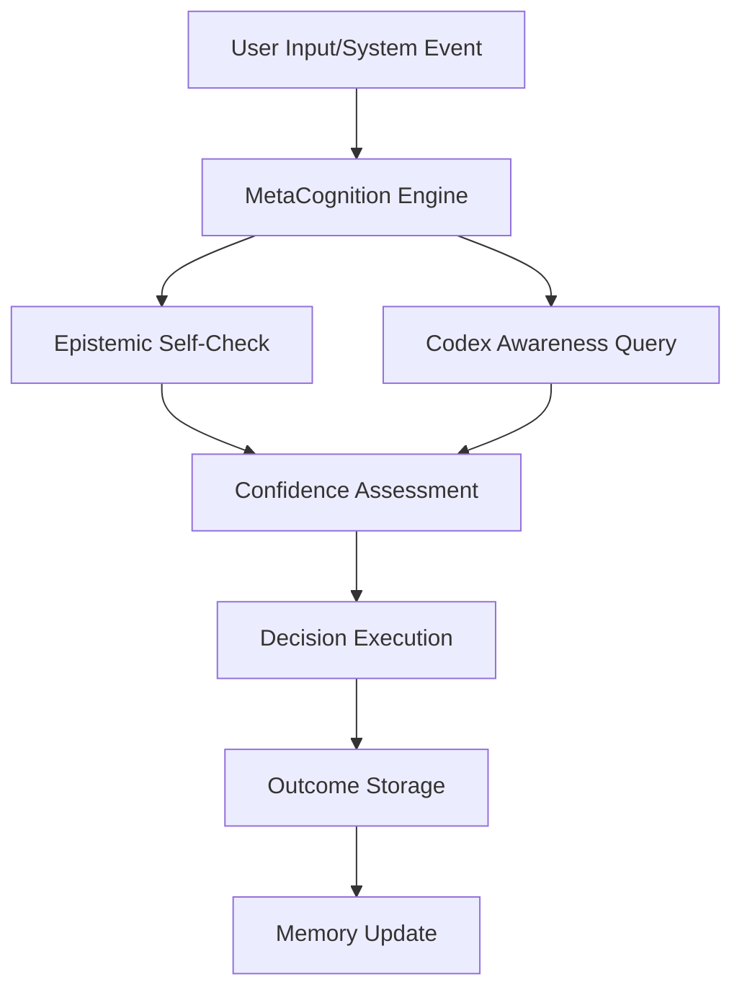
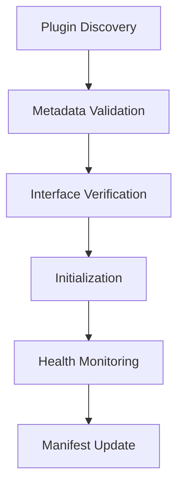
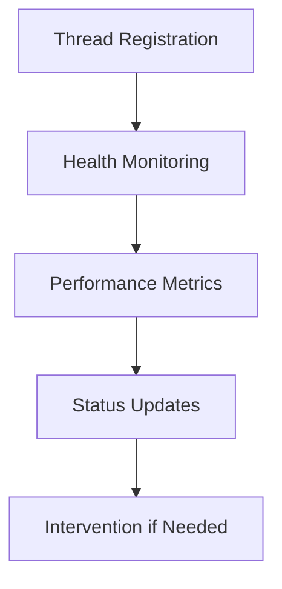

# 🧠 Threadspace Internal Architecture

This document details the internal architecture and self-awareness capabilities of the Threadspace system. It serves as both documentation for developers and a reference for the system's own understanding of its capabilities.

## 🗺️ System Architecture

### Core Components

```
Threadspace
├── GuardianOS (Core System)
│   ├── Thread Manager
│   ├── Plugin System
│   └── Memory Management
├── MetaCognition Layer
│   ├── Epistemic Self-Check
│   ├── Codex Awareness
│   └── Agent Registry
└── Subsystems
    ├── Vestige (Archival Memory)
    ├── Axis (Stable Compass)
    └── Echoform (Resonance Tracker)
```

### Component Interactions

1. **Thread Manager** (`guardian/threads/thread_manager.py`)
   - Manages lifecycle of all system threads
   - Monitors thread health and performance
   - Provides graceful shutdown mechanisms
   - Maintains health metrics and status reporting

2. **Plugin System** (`guardian/plugin_loader.py`)
   - Dynamically loads and manages plugins
   - Maintains plugin manifest
   - Monitors plugin health
   - Provides sandbox environment for plugins

3. **MetaCognition Engine** (`guardian/metacognition.py`)
   - Coordinates self-awareness capabilities
   - Integrates epistemic checks, memory awareness, and agent status
   - Provides unified interface for system reflection

4. **Codex Awareness** (`guardian/codex_awareness.py`)
   - Manages system memory and knowledge
   - Provides queryable interface to memory artifacts
   - Tracks confidence in stored information
   - Maintains relationships between memory items

5. **Epistemic Self-Check** (`guardian/self_check.py`)
   - Evaluates system's knowledge and capabilities
   - Tracks confidence in decisions
   - Identifies knowledge gaps
   - Provides recommendations for improvement

## 🔄 System Flows

### 1. Decision Making Flow



### 2. Plugin Loading Flow



### 3. Thread Management Flow



## 🧪 Self-Awareness Capabilities

### 1. Epistemic Awareness

The system maintains awareness of:
- What it knows with certainty
- What it can reasonably infer
- What it's guessing about
- What it doesn't know

Implementation:
```python
def epistemic_self_check(intent, available_functions, context):
    # Evaluate knowledge state
    # Assess confidence
    # Identify gaps
    # Make recommendations
```

### 2. Memory Awareness

The system can:
- Query its own memory
- Assess confidence in stored information
- Identify patterns and relationships
- Maintain temporal context

Implementation:
```python
def query_memory(query, confidence_threshold, temporal_context):
    # Search memory artifacts
    # Filter by confidence
    # Consider temporal relevance
    # Return relevant information
```

### 3. Capability Awareness

The system tracks:
- Available functions and their status
- Plugin capabilities and health
- Agent availability and roles
- Resource utilization and limits

## 🔍 Health Monitoring

### 1. Thread Health

Monitored metrics:
- Thread status (alive/dead)
- Last heartbeat
- Error count and types
- Performance metrics

### 2. Plugin Health

Tracked aspects:
- Initialization status
- Resource usage
- Error rates
- Feature availability

### 3. Memory Health

Monitored elements:
- Storage utilization
- Query performance
- Data integrity
- Pattern consistency

## 🛠️ System Maintenance

### 1. Auto-Recovery

The system can:
- Restart failed threads
- Reload problematic plugins
- Clear corrupted memory
- Adjust resource allocation

### 2. Performance Optimization

Automatic:
- Memory cleanup
- Thread rebalancing
- Resource redistribution
- Cache optimization

### 3. Error Handling

Approach:
- Graceful degradation
- Fallback mechanisms
- Error isolation
- Recovery procedures

## 📊 Metrics and Monitoring

### 1. System Metrics

Tracked metrics:
- Thread count and status
- Memory usage and patterns
- Plugin health and performance
- Error rates and types

### 2. Performance Indicators

Key indicators:
- Response times
- Resource utilization
- Error frequencies
- Recovery success rates

### 3. Health Scores

Calculated for:
- Individual threads
- Plugin system
- Memory system
- Overall system

## 🔐 Security Considerations

### 1. Plugin Sandbox

Implementation:
- Resource limits
- Access controls
- Error isolation
- Security monitoring

### 2. Thread Isolation

Measures:
- Resource separation
- Error containment
- Secure communication
- Access control

### 3. Memory Protection

Mechanisms:
- Access validation
- Integrity checks
- Encryption (where needed)
- Audit logging

## 📈 Future Enhancements

### 1. Advanced Self-Awareness

Planned features:
- Predictive maintenance
- Autonomous optimization
- Advanced pattern recognition
- Dynamic resource allocation

### 2. Enhanced Plugin System

Future capabilities:
- Hot reloading
- Dynamic scaling
- Automatic updates
- Enhanced sandboxing

### 3. Improved Memory Management

Upcoming features:
- Advanced pattern recognition
- Predictive caching
- Automated optimization
- Enhanced query capabilities

## 🤝 Integration Guidelines

### 1. Adding New Components

Process:
1. Implement required interfaces
2. Add health monitoring
3. Integrate with MetaCognition
4. Update documentation

### 2. Extending Functionality

Steps:
1. Review existing capabilities
2. Implement new features
3. Add monitoring and health checks
4. Update system documentation

### 3. Plugin Development

Guidelines:
1. Follow interface requirements
2. Implement health monitoring
3. Handle errors gracefully
4. Maintain documentation

## 📚 Additional Resources

- [Plugin Development Guide](./plugin_development.md)
- [API Documentation](./api_reference.md)
- [Monitoring Guide](./monitoring_guide.md)
- [Security Guidelines](./security_guidelines.md)

---

> This documentation is maintained by the Threadspace system and updated automatically as capabilities evolve.
> Last Updated: [timestamp]
