# Threadspace System Architecture

## 🏗️ System Overview

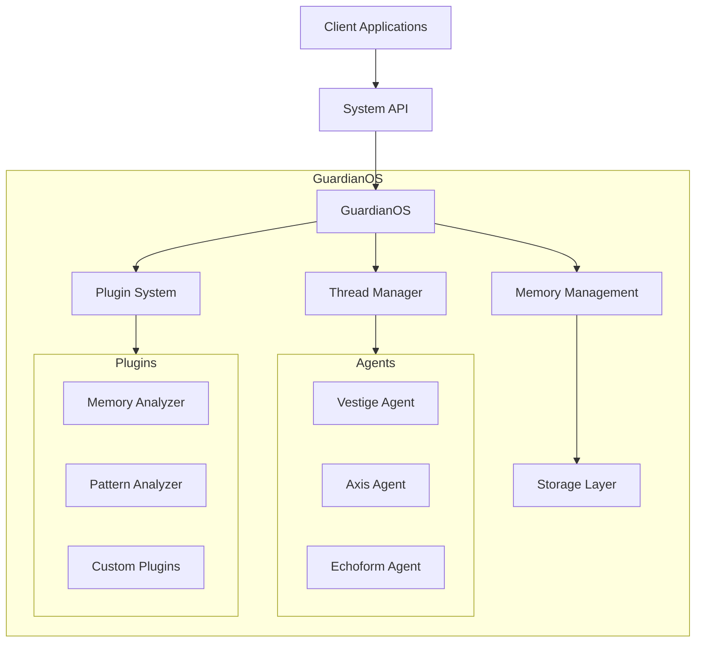

## 🧠 Core Components

### 1. GuardianOS

The central orchestrator managing system operations, resource allocation, and component lifecycle.

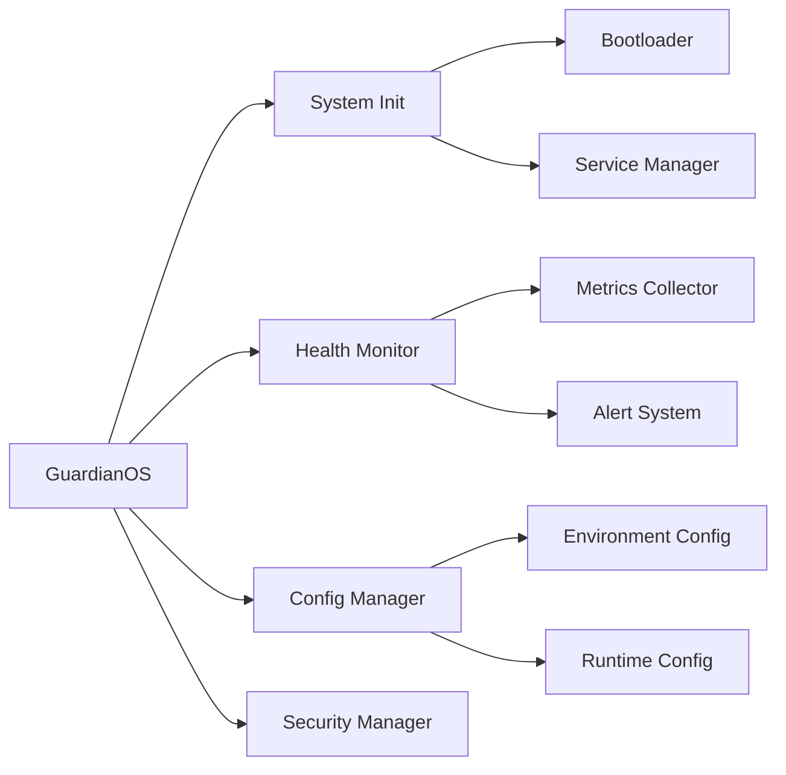

### 2. Thread Management

Handles concurrent operations and agent lifecycle management.

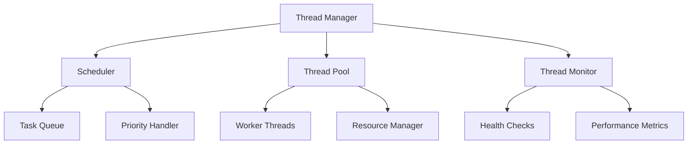

### 3. Memory System

Manages system memory, pattern recognition, and data persistence.

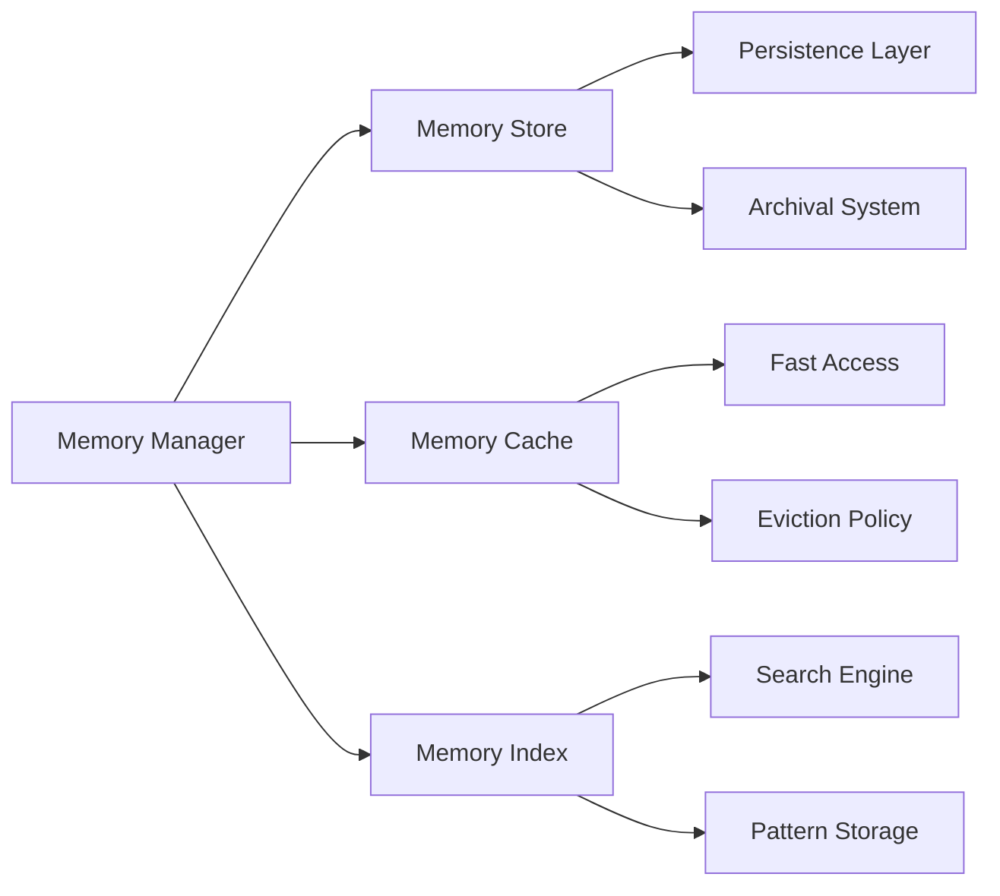

## 🤖 Agent Architecture

### 1. Vestige Agent

Memory preservation and pattern recognition system.

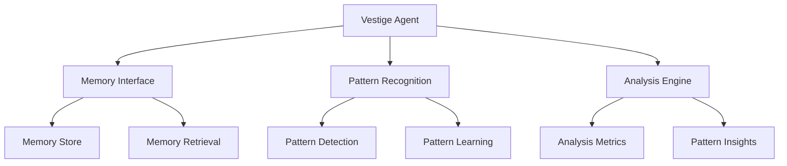

### 2. Axis Agent

Decision-making and routing system.

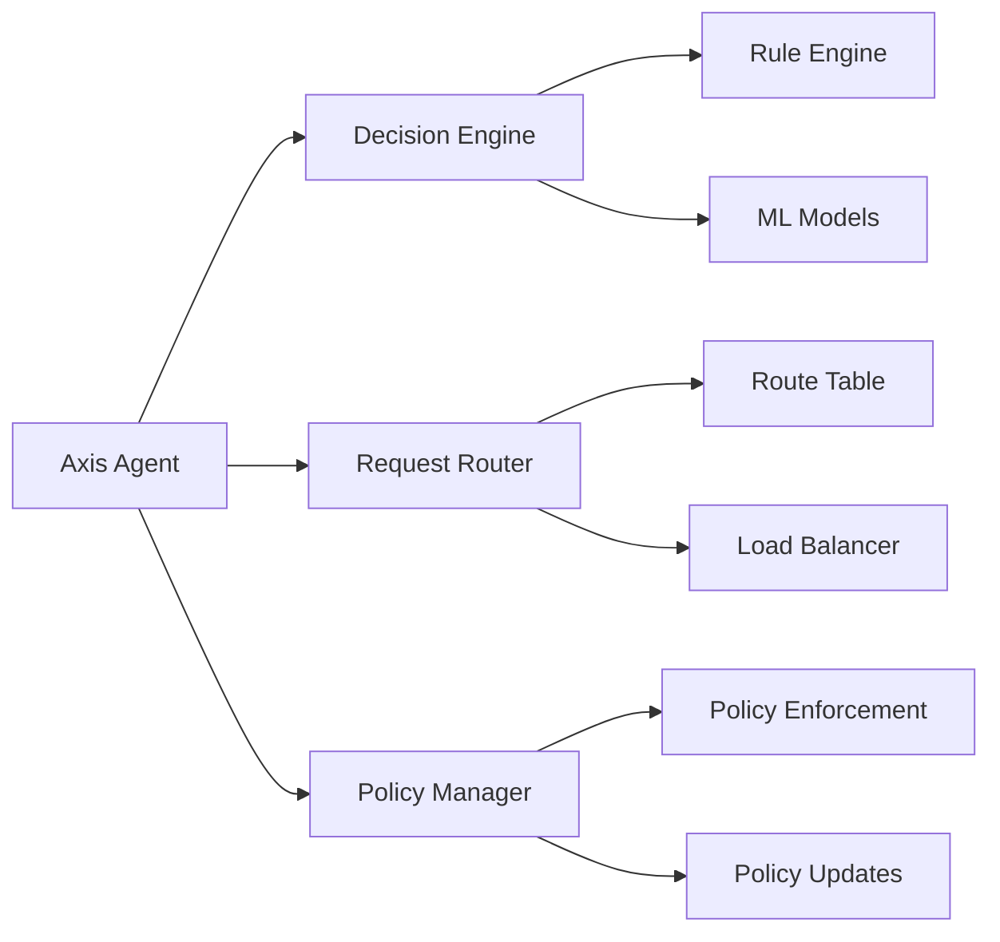

### 3. Echoform Agent

System resonance and state transition management.

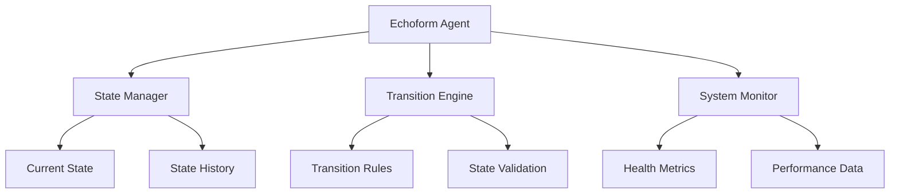

## 🔌 Plugin System

### Architecture

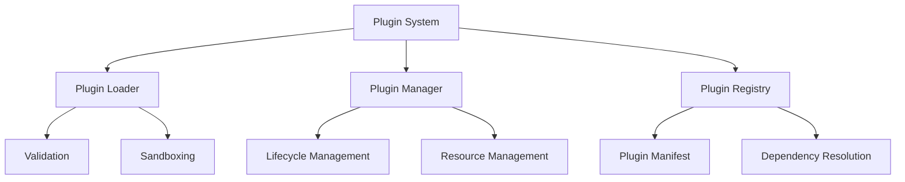

### Plugin Integration

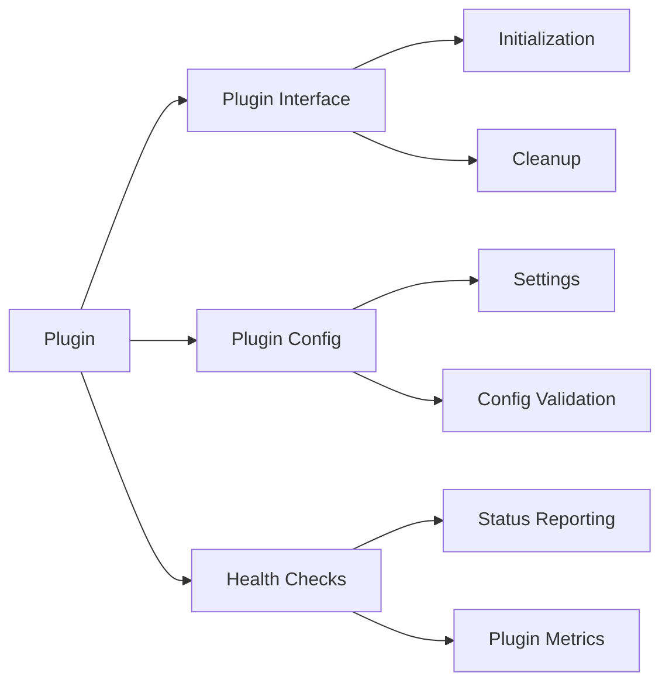

## 🔒 Security Architecture

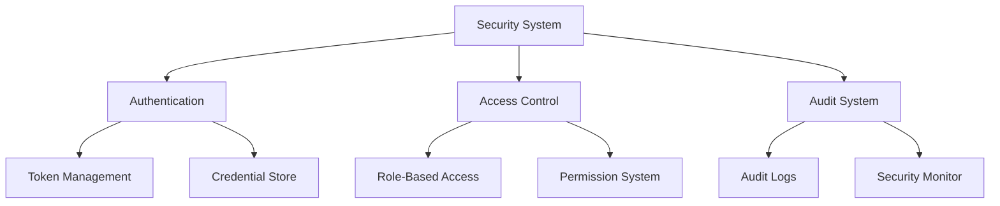

## 📊 Data Flow

### Request Processing

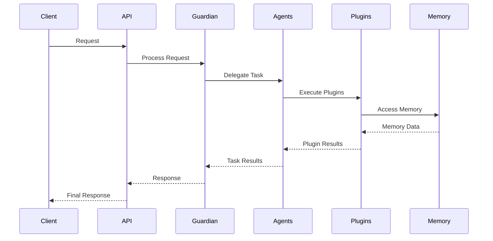

### Memory Operations

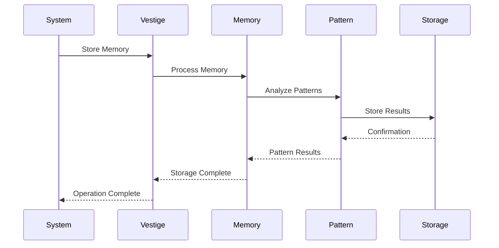

## 🔄 System States

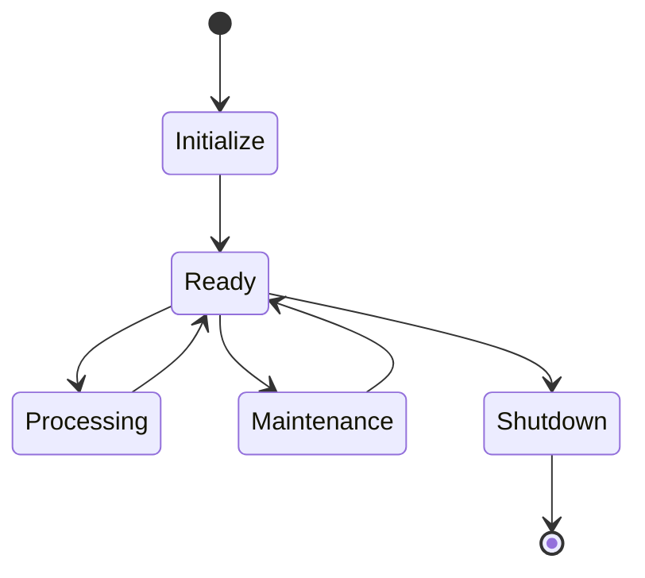

## 📈 Monitoring & Metrics

### Metric Collection

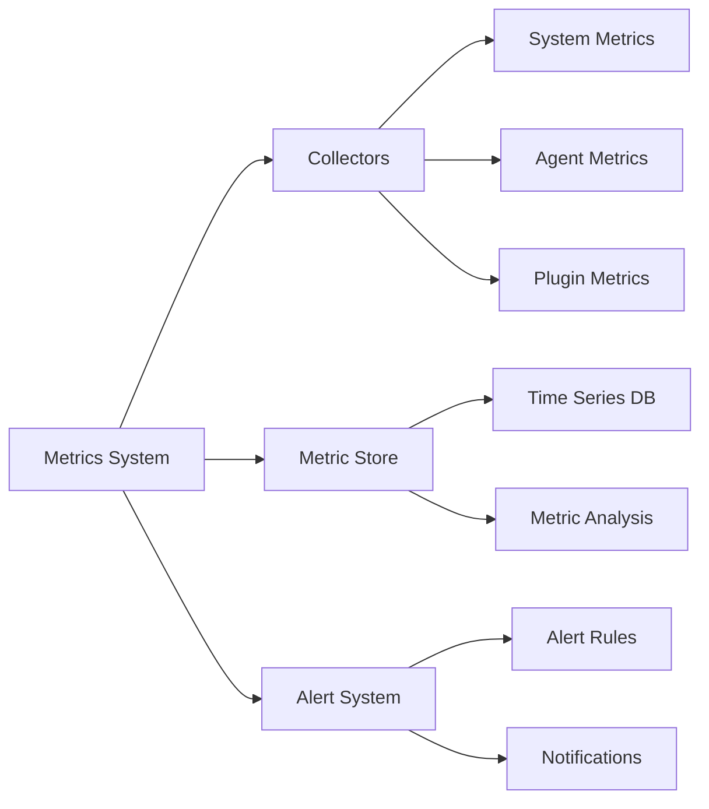

## 🔧 Configuration Management

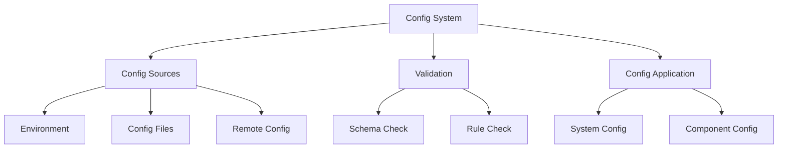

## 📝 Documentation Structure

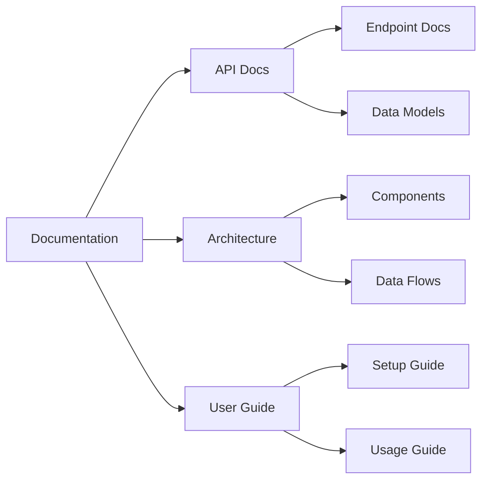

## 🔍 Additional Resources

- [API Documentation](api_reference.md)
- [Plugin Development Guide](plugin_development.md)
- [Security Guidelines](security_guidelines.md)
- [Deployment Guide](deployment_guide.md)

---

Last Updated: [DATE]
Version: 1.0.0
